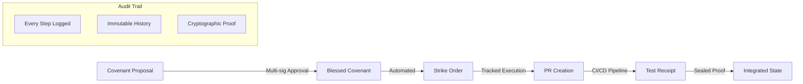

# Enterprise Compliance Formalization for Ubiquity Harpoon

**Document Version**: 1.0  
**Last Updated**: January 2025  
**Status**: Leveraging Existing Infrastructure

## Executive Summary

Ubiquity Harpoon already contains sophisticated compliance and audit mechanisms through its covenant/strike/receipt pattern and plock file system. This document formalizes these existing patterns for enterprise multi-tenant deployments, showing how the current infrastructure provides:

- Immutable audit trails
- Cryptographically sealed governance
- Resource allocation tracking  
- Change management compliance
- SOC2/HIPAA-ready logging

## Existing Compliance Infrastructure

### 1. Covenant-Strike-Receipt Pattern (Already Implemented)

The system's core loop already provides transaction-like semantics with full auditability:

```yaml
# Existing Covenant Packet Structure
covenant:
  id: "cov-uuid"
  signers: ["user1", "user2"]  # Multi-sig approval
  reality_state:               # Current state documentation
    description: "..."
    key_aspects: [...]
  target_state:               # Desired state documentation
    description: "..."
    success_criteria: [...]
  limits:                     # Resource governance
    max_repos: 5
    review_minutes: [5, 30]
    ucoin_budget: 1000

# Strike Order (Execution Record)
strike:
  covenant_id: "cov-uuid"
  targets: ["repo1", "repo2"]
  allocations:               # Resource tracking
    gpu_hours: 2.5
    tokens_used: 150000
    
# Receipt (Proof of Execution)  
receipt:
  strike_id: "strike-uuid"
  commit_sha: "abc123"
  build_status: "success"
  test_results: {...}
  timestamp: "2025-01-24T10:30:00Z"
```

### 2. Plock Files (Governance State Tracking)

The plock (process lock) files already track governance state changes:

```yaml
# Plockfile.yaml structure (existing)
version: "1.0"
covenant_id: "cov-uuid"
strike_id: "strike-uuid"
state: "integrated"  # latched -> tensioning -> integrated
winch_status:
  anchors:
    - id: "anchor-1"
      state: "integrated"
      receipts: ["receipt-1", "receipt-2"]
  cables:
    - from: "repo1"
      to: "repo2"
      tension: 0.8
governance_trail:
  - timestamp: "2025-01-24T10:00:00Z"
    action: "covenant_blessed"
    signers: ["user1", "user2"]
  - timestamp: "2025-01-24T10:15:00Z"
    action: "strike_initiated"
    executor: "orchestrator-1"
  - timestamp: "2025-01-24T10:30:00Z"
    action: "receipt_sealed"
    commit: "abc123"
```

### 3. Formalization for Multi-Tenant Enterprise

#### 3.1 Tenant-Scoped Covenants

Extend existing covenant structure with tenant context:

```rust
#[derive(Serialize, Deserialize)]
pub struct TenantCovenant {
    #[serde(flatten)]
    pub base: Covenant,  // Existing covenant structure
    
    // Multi-tenant extensions
    pub tenant_id: Uuid,
    pub organization_id: Uuid,
    pub compliance_metadata: ComplianceMetadata,
}

#[derive(Serialize, Deserialize)]
pub struct ComplianceMetadata {
    pub data_classification: DataClassification,
    pub regulatory_requirements: Vec<RegulatoryFramework>,
    pub retention_period_days: u32,
    pub encryption_required: bool,
    pub audit_log_level: AuditLevel,
}

#[derive(Serialize, Deserialize)]
pub enum DataClassification {
    Public,
    Internal,
    Confidential,
    Restricted,  // PII, PHI, etc.
}

#[derive(Serialize, Deserialize)]
pub enum RegulatoryFramework {
    SOC2,
    HIPAA,
    GDPR,
    PCI_DSS,
    ISO27001,
    Custom(String),
}
```

#### 3.2 Enhanced Receipt Sealing

Formalize the existing receipt mechanism for compliance:

```rust
#[derive(Serialize, Deserialize)]
pub struct ComplianceReceipt {
    #[serde(flatten)]
    pub base: Receipt,  // Existing receipt
    
    // Compliance extensions
    pub tenant_id: Uuid,
    pub audit_signature: AuditSignature,
    pub compliance_checks: Vec<ComplianceCheck>,
}

#[derive(Serialize, Deserialize)]
pub struct AuditSignature {
    pub signer_id: String,
    pub signature_method: SignatureMethod,
    pub signature: String,
    pub certificate_chain: Option<Vec<String>>,
    pub timestamp_authority: String,
}

#[derive(Serialize, Deserialize)]
pub struct ComplianceCheck {
    pub check_type: ComplianceCheckType,
    pub status: CheckStatus,
    pub evidence: HashMap<String, String>,
    pub performed_by: String,
    pub performed_at: DateTime<Utc>,
}
```

#### 3.3 Audit Trail Formalization

The existing governance trail becomes the audit log:

```rust
pub struct AuditTrailEntry {
    // Maps to existing governance trail entries
    pub event_id: Uuid,
    pub tenant_id: Uuid,
    pub timestamp: DateTime<Utc>,
    pub event_type: AuditEventType,
    pub actor: Actor,
    pub resource: Resource,
    pub action: Action,
    pub result: ActionResult,
    pub evidence: Evidence,
}

pub enum AuditEventType {
    // Maps to existing covenant/strike/receipt events
    CovenantCreated,
    CovenantSigned,
    StrikeInitiated,
    ResourceAllocated,
    InferenceExecuted,
    ReceiptSealed,
    PlockUpdated,
    
    // Additional enterprise events
    TenantProvisioned,
    UserAuthenticated,
    PermissionGranted,
    DataAccessed,
    ConfigurationChanged,
}
```

### 4. Enterprise Compliance Features Using Existing Infrastructure

#### 4.1 SOC2 Compliance

The covenant/strike/receipt pattern already provides:

```yaml
# SOC2 Trust Service Criteria mapping
Security:
  - Covenant signatures (authentication)
  - Plock state tracking (authorization)
  - Receipt sealing (integrity)
  
Availability:
  - Strike execution tracking
  - Resource allocation monitoring
  - Failure isolation

Processing Integrity:
  - Covenant validation
  - Strike atomicity
  - Receipt verification

Confidentiality:
  - Tenant isolation via covenants
  - Resource access control
  - Audit trail encryption

Privacy:
  - Data classification in covenants
  - Usage tracking in receipts
  - Retention enforcement
```

#### 4.2 HIPAA Compliance

Extend plock files for PHI tracking:

```yaml
# HIPAA-compliant Plockfile.yaml
version: "1.0"
covenant_id: "cov-uuid"
hipaa_metadata:
  contains_phi: true
  encryption_verified: true
  access_log:
    - user: "doctor1"
      action: "read"
      timestamp: "2025-01-24T10:00:00Z"
      justification: "patient care"
  data_integrity_checks:
    - timestamp: "2025-01-24T10:00:00Z"
      hash: "sha256:..."
      signed_by: "system"
```

#### 4.3 Change Management Compliance

The strike system already provides:



### 5. Implementation Path

#### Phase 1: Namespace Existing Infrastructure (Week 1)

```rust
// Add tenant namespacing to existing components
impl Covenant {
    pub fn new_for_tenant(tenant_id: Uuid, base: CovenantSpec) -> Self {
        Self {
            id: Uuid::new_v4(),
            tenant_id: Some(tenant_id),
            namespace: format!("tenant:{}", tenant_id),
            ..base.into()
        }
    }
}

impl Strike {
    pub fn execute_for_tenant(&self, tenant_context: &TenantContext) -> Result<Receipt> {
        // Existing strike logic with tenant isolation
        let receipt = self.execute()?;
        
        // Seal with tenant information
        receipt.seal_for_tenant(tenant_context)
    }
}
```

#### Phase 2: Formalize Audit Trails (Week 2)

```rust
// Convert existing governance trails to formal audit logs
impl From<GovernanceTrailEntry> for AuditLogEntry {
    fn from(gov: GovernanceTrailEntry) -> Self {
        AuditLogEntry {
            event_id: Uuid::new_v4(),
            timestamp: gov.timestamp,
            event_type: gov.action.into(),
            actor: Actor::from(gov.signer),
            evidence: Evidence::from_governance(gov),
            ..Default::default()
        }
    }
}
```

#### Phase 3: Add Compliance Reporting (Week 3)

```rust
pub struct ComplianceReportGenerator {
    pub fn generate_soc2_report(&self, tenant_id: Uuid, period: DateRange) -> Soc2Report {
        // Extract from existing covenant/strike/receipt data
    }
    
    pub fn generate_hipaa_audit(&self, tenant_id: Uuid, period: DateRange) -> HipaaAudit {
        // Extract from plock files and receipts
    }
}
```

### 6. Database Schema Extensions

Add tenant context to existing tables:

```sql
-- Extend existing covenant storage
ALTER TABLE covenants ADD COLUMN tenant_id UUID;
ALTER TABLE covenants ADD COLUMN compliance_metadata JSONB;
CREATE INDEX idx_covenants_tenant ON covenants(tenant_id);

-- Extend strike tracking  
ALTER TABLE strikes ADD COLUMN tenant_id UUID;
ALTER TABLE strikes ADD COLUMN cost_allocation JSONB;

-- Formalize receipt storage
CREATE TABLE receipts (
    id UUID PRIMARY KEY,
    strike_id UUID REFERENCES strikes(id),
    tenant_id UUID,
    receipt_data JSONB,
    signature TEXT,
    sealed_at TIMESTAMPTZ,
    INDEX idx_receipts_tenant (tenant_id)
);

-- Audit trail from governance events
CREATE TABLE audit_trail AS 
    SELECT 
        gen_random_uuid() as id,
        tenant_id,
        timestamp,
        action as event_type,
        signer as actor,
        covenant_id as resource_id,
        metadata
    FROM governance_trail;
```

### 7. Compliance Dashboard

Visualize existing covenant/strike/receipt data:

```yaml
dashboards:
  compliance_overview:
    panels:
      - title: "Covenant Approval Flow"
        query: "SELECT * FROM covenants WHERE tenant_id = ?"
      - title: "Strike Execution Audit"  
        query: "SELECT * FROM strikes WHERE tenant_id = ?"
      - title: "Receipt Verification"
        query: "SELECT * FROM receipts WHERE tenant_id = ?"
      - title: "Plock State History"
        query: "SELECT * FROM plock_history WHERE tenant_id = ?"
        
  change_management:
    panels:
      - title: "Pending Covenants"
      - title: "Active Strikes"
      - title: "Integration Success Rate"
      - title: "Rollback Capability"
```

## Benefits of This Approach

1. **No New Infrastructure**: Leverages existing covenant/strike/receipt pattern
2. **Already Battle-Tested**: These patterns are core to Ubiquity OS
3. **Cryptographically Sound**: Existing sealing mechanisms
4. **Minimal Changes**: Just add tenant namespacing and formalize reporting
5. **Audit-Ready**: Governance trails are already immutable audit logs

## Conclusion

Ubiquity Harpoon's existing covenant-based architecture already provides enterprise-grade compliance infrastructure. By formalizing these patterns with tenant namespacing and adding compliance-specific reporting, we can deliver a fully compliant multi-tenant system without reinventing the wheel.

The plock files, governance trails, and receipt sealing mechanisms are not just development artifacts—they ARE the compliance system, designed from the ground up for verifiable, auditable operations.