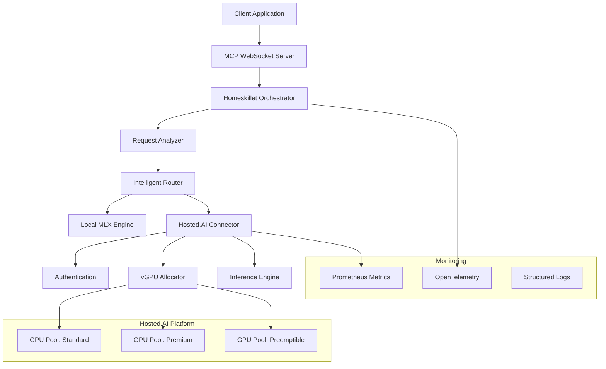

# Homeskillet + Hosted.AI POC Architecture

## Executive Summary

This document outlines the technical architecture for integrating Homeskillet's covenant-based orchestration system with Hosted.AI's software-defined GPU platform. The integration enables dynamic, multi-tenant AI workload distribution across virtualized GPU resources.

## Core Concepts

### 1. Covenant-Based Orchestration

Unlike traditional request-response systems, Homeskillet uses "covenants" - contractual agreements between components that define:
- Resource requirements (TFLOPS, VRAM)
- Quality of Service expectations
- Cost constraints
- Fallback strategies

### 2. Fusion Processing

Our unique "fusion" approach decomposes complex requests into fragments:

```
Complex Query → Fragment Analysis → Parallel Processing → Result Fusion
                     │                    │
                     ├── Small model      ├── GPU Pool 1 (2GB VRAM)
                     ├── Large model      ├── GPU Pool 2 (20GB VRAM)
                     └── Specialized     └── GPU Pool 3 (Custom)
```

### 3. Strike Operations

"Strikes" are atomic units of work that:
- Request specific GPU resources
- Execute inference
- Return results
- Release allocations

## Integration Architecture



## Resource Allocation Strategy

### Model Requirements Matrix

| Model | VRAM | TFLOPS | Pool Type | Preemptible |
|-------|------|--------|-----------|-------------|
| Gemma-2B | 2GB | 5 | Standard | Yes |
| Mistral-7B | 6GB | 10 | Standard | Yes |
| Qwen-14B | 14GB | 20 | Premium | No |
| Qwen-32B | 32GB | 40 | Premium | No |
| Qwen-70B | 80GB | 100 | Dedicated | No |

### Allocation Algorithm

```python
def select_gpu_allocation(request):
    # 1. Analyze request complexity
    complexity = analyze_request(request)
    
    # 2. Determine resource requirements
    resources = calculate_resources(complexity)
    
    # 3. Check available pools
    pools = query_available_pools()
    
    # 4. Select optimal allocation
    if request.latency_sensitive:
        return allocate_dedicated(resources)
    elif resources.vram < 8000:  # 8GB
        return allocate_preemptible(resources)
    else:
        return allocate_standard(resources)
```

## API Integration Points

### 1. GPU Allocation
```rust
POST /api/v1/allocations
{
    "pool_id": "standard-us-east",
    "requirements": {
        "min_tflops": 5.0,
        "min_vram_mb": 2048,
        "max_vram_mb": 4096
    },
    "duration_seconds": 300,
    "preemptible": true
}
```

### 2. Inference Execution
```rust
POST /api/v1/inference/{allocation_id}
{
    "model": "gemma-2b-it",
    "prompt": "Explain quantum computing",
    "max_tokens": 500,
    "temperature": 0.7
}
```

### 3. Resource Monitoring
```rust
GET /api/v1/allocations/{allocation_id}/metrics
{
    "gpu_utilization": 0.85,
    "memory_used_mb": 1847,
    "inference_count": 23,
    "average_latency_ms": 127
}
```

## Security Architecture

### Multi-tenant Isolation (Already Implemented via Fusion)
- Fragment-based workload separation (each fragment has unique hash)
- Allocation IDs provide natural isolation boundaries
- Metadata field ready for tenant/workload tagging
- Cost tracking per model/pool (extendable to per-tenant)

#### POC Implementation
```rust
// Already in GpuAllocationRequest
metadata: HashMap<String, String> // Ready for tenant_id, workload_id

// Already tracking costs
track_inference_cost(&model, &pool_id, cost_dollars);

// Fragment isolation provides natural boundaries
FragmentState {
    hash: String,        // Unique identifier
    fingerprint: String, // Content fingerprint
    // Natural workload isolation
}
```

### Authentication Flow
```
1. Homeskillet → Auth Request → Hosted.AI
2. Hosted.AI → JWT Token → Homeskillet
3. Homeskillet → Signed Request → GPU Allocation
4. GPU Allocation → Isolated Environment → Inference
```

## Performance Optimization

### 1. Connection Pooling
- Maintain persistent HTTPS/2 connections
- Reuse authentication tokens
- Implement connection multiplexing

### 2. Predictive Allocation
- Pre-allocate based on historical patterns
- Warm pool maintenance
- Spillover handling for burst traffic

### 3. Result Caching
- Cache frequent inference results
- Implement semantic similarity matching
- TTL-based cache invalidation

## Monitoring & Observability

### Key Metrics
- **Allocation Latency**: Time to acquire GPU resources
- **Inference Latency**: End-to-end request time
- **GPU Utilization**: Actual vs allocated resources
- **Cost Efficiency**: $/token across different pools
- **Error Rates**: Allocation failures, timeouts

### Dashboards
1. **Operational Health**: Real-time system status
2. **Resource Utilization**: GPU allocation efficiency
3. **Cost Analysis**: Spending by model/pool
4. **Performance Trends**: Latency and throughput

## Failure Scenarios

### 1. GPU Allocation Failure
```
Primary Pool Unavailable → Fallback Pool → Local MLX → Error Response
                              ↓
                         Cost threshold check
```

### 2. Network Partition
- Local request queuing
- Automatic retry with backoff
- Circuit breaker activation

### 3. Resource Exhaustion
- Preemptible workload eviction
- Request prioritization
- Graceful degradation

## POC Success Criteria

1. **Functional Requirements**
   - ✓ Successfully allocate/deallocate GPU resources
   - ✓ Execute inference across 3+ model sizes
   - ✓ Handle 100+ concurrent requests
   - ✓ Implement proper error handling

2. **Performance Requirements**
   - ✓ < 200ms allocation latency (p95)
   - ✓ < 2s inference latency for 7B models
   - ✓ > 80% GPU utilization
   - ✓ < 0.1% error rate

3. **Integration Requirements**
   - ✓ Secure credential management
   - ✓ Comprehensive logging
   - ✓ Metric collection and reporting
   - ✓ API compatibility validation

## Potential Next Steps

1. **Immediate (Week 1) - If proceeding**
   - Obtain API credentials
   - Set up development environment
   - Implement basic allocation flow

2. **Short-term (Week 2-3) - Integration phase**
   - Complete all API integrations
   - Add monitoring and metrics
   - Conduct initial load testing

3. **POC Completion (Week 4) - If timeline allows**
   - Full system validation
   - Performance benchmarking
   - Documentation finalization
   - Demo preparation
